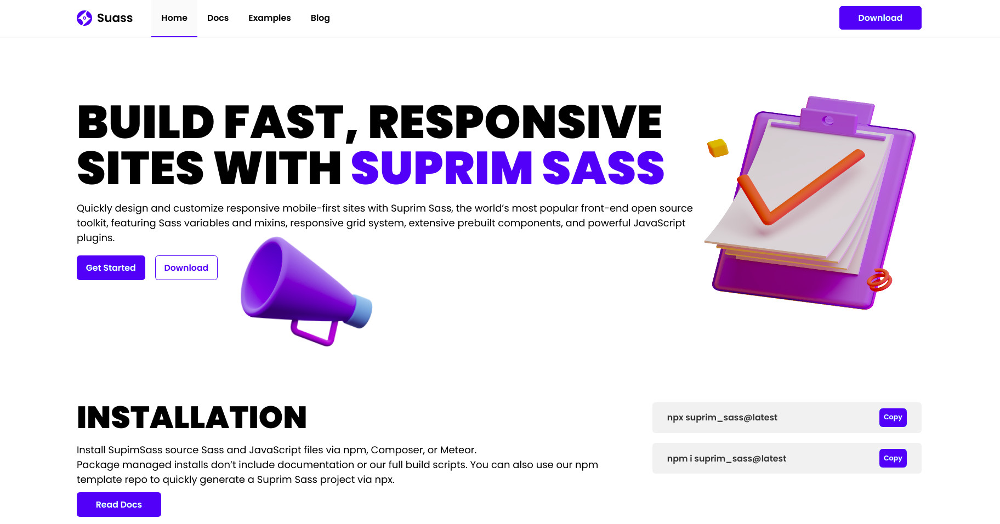

### Fast Static Site Developement With Sass

suprim_sass helps you to add scss to your project and start as soon as possible. No need add dependencies.

#### Features

- Layouts
- Responsive Typography
- Custom Colors Variables Resubale
- Components
- New Updated Module Method

#### Node Cli

```javascript
 npx suprim_sass@latest
```

#### Npm Package

```javascript
 npm i suprim_sass
```

#### Folder Structure

```bash
.
├── main.scss
├── base
│   ├── _index.scss
│   ├── _base.scss
│   ├── _reset.scss
│   ├── _typography.scss
│   └── _variables.scss
├── components
│   ├── _index.scss
│   ├── _button.scss
│   └── _nav.scss
├── layouts
│   ├── _index.scss
│   ├── _breakpoints.scss
│   └── _layouts.scss
├── mixins
│   ├── _index.scss
│   └── _mixin.scss
├── pages
│   └── _index.scss
└── utils
    ├── _index.scss
    └── _utils.scss
```

#### Components Page



<p>More features comming soon. Modular in Focus</p>
